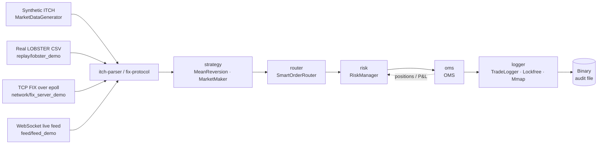

# HFT Infrastructure Lab


Complete low-latency infrastructure lab for HFT systems — kernel tuning, networking, order management, and monitoring.

## Performance Highlights (Red Hat EL10, VirtualBox 2-core VM)
- Order book matching: **17.8M orders/sec repeatable gate — measured 60–78M orders/sec** on the flat-array book with occupancy bitmaps (ctz/clz word scans, O(gap/64) cursor advance). Reproduce: `./orderbook/benchmark_orderbook 1000000 7 17.8` — multi-trial, fresh book per trial, std::map cross-check, threshold applied to the *slowest* trial
- Order book — flat-array variant (`orderbook/orderbook_flat.hpp`): **O(1) add/match, zero heap alloc** — see `./orderbook/orderbook_flat 1000000` for live head-to-head vs the std::map baseline
- **FullOrderBook L3** (`orderbook/orderbook_pro.hpp`): production-grade L3 matching engine — FIFO queue per price level, 10 order types (LIMIT/IOC/FOK/POST_ONLY/ICEBERG/STOP/PEG/MARKET/HIDDEN/AON) + OCO/bracket/trailing-stop, auction cross, self-trade prevention, LULD + MIFID II compliance, snapshot+delta recovery, integrity audit, microstructure analytics (VPIN, Kyle's λ, OFI, Lee-Ready, Hurst). 300+ tests: `./orderbook/orderbook_pro_demo 100000`
- ITCH parser (C++): **60M msg/sec** (16ns/msg, p50=40ns, p99=50ns)
- Market Simulator E2E (C++): **573K msg/sec** (full pipeline: ITCH gen→parse→OMS→P&L)
- OMS (C++): **11.6M orders/sec** (submit+fill, p50=60ns, p99=121ns, fixed-point prices)
- Risk Manager (C++): **7.9M checks/sec** (p50=91ns, p99=140ns)
- Smart Router (C++): **9.7M routes/sec** (p50=70ns, p99=150ns)
- Trade Logger (C++): **14.3M events/sec** (p50=41ns, p99=60ns)
- Mean Reversion Strategy (C++): **8.0M ticks/sec** (p50=100ns, p99=121ns)
- Market Maker (C++): two-sided quoter with inventory skew, max-inventory caps — see `./strategy/mm_demo 100000` for a live simulation with adversary crosses
- FIX 4.2 Parser (C++): **5.5M msg/sec** (p50=150ns, p99=250ns)
- OUCH 4.2 Encoder (C++): **19.9M msg/sec** (p50=30ns, p99=40ns)
- Lock-free SPSC queue: **17.6M msg/sec** (C++, 10M messages benchmarked)
- Cache latency: L1=1.6ns, L2=4.3ns, L3=154ns, RAM=100-110ns
- Ping-pong thread latency: **81ns p50**, 120ns p99 (8.3M round-trips/sec)
- Orderbook insert: **40ns p50**, 85ns avg (11.8M ops/sec)
- Multicast serialization (C++): **23.2M msg/sec** (serialize+deserialize, p50=20ns)
- DPDK poll mode (C++): **19.9M pkt/sec**, 2.3x faster than interrupt mode
- Estimated tick-to-trade: **~5.8 μs** (software-only, VM) — [full breakdown](docs/tick-to-trade.md)

## Benchmarks


Reproduce locally with `scripts/run_benchmarks.sh`, or trigger the
[`benchmarks` workflow](https://github.com/kanar11/hft-infra-lab/actions/workflows/benchmarks.yml)
from the Actions tab (no local Linux needed — CI runs the script and commits
the result to [`BENCHMARKS.md`](BENCHMARKS.md)).

## Pipeline



Each module is a header-only C++ class; `simulator/sim_demo` wires them together end-to-end. The `lockfree/` headers (SPSC/MPSC/MPMC/Sequencer/WaitableMPSC/VarlenRingBuffer) bridge stages that run on different threads — see `run_pipeline_threaded` in `simulator/market_sim.hpp` for a producer/consumer example. Python bindings (`bindings/pyhft`) wrap the OMS / Risk / FlatOrderBook for notebook-driven research.

## Real-data replay

The synthetic simulator stresses *throughput* on LCG-generated events; for an apples-to-apples check on real Nasdaq order data, use **`replay/lobster_demo`** — it streams a [LOBSTER](https://lobsterdata.com) message CSV (free sample days available) through the same OMS, Risk, and Logger:

```bash
./replay/lobster_demo replay/sample_aapl.csv                          # bundled mini-fixture (20 events)
./replay/lobster_demo /path/to/AAPL_2012-06-21_messages.csv           # full day of real AAPL data
```

Format details and download links: [`replay/README.md`](replay/README.md).

## Live WebSocket feed

A fourth data source — a minimal **RFC 6455 WebSocket** client + a self-contained mock server in a single binary (Binance-style JSON trade stream). It demonstrates the protocol structure (HTTP upgrade, frame header, opcode, length encoding) without depending on libwebsockets / Boost.Beast.

```bash
./feed/feed_demo   # spawn mock server + WsClient in one process (50 trades)
```

Protocol details, opcodes, and connecting to real exchanges: [`feed/README.md`](feed/README.md).

## Observability & analytics layer

On top of the hot paths, every core module carries a tested read-only metrics
surface (built up across ~590 numbered expansion commits, one feature + tests
per commit, all CI-green):

- **oms/** — full TCA (speed/size/price axes: min/avg/max time-to-fill and
  time-to-cancel, price improvement vs limit, fee bps of turnover), P&L
  attribution per name (typed dollar getters, best/worst symbol,
  profit/loss concentration), round-trip accounting, reject histogram with
  `most_common_reject`, fat-finger high-waters, notional vs per-order fill
  ratios, `cancel_to_fill_ratio`
- **risk/** — the complete moment family on the P&L stream (mean, variance,
  skewness, excess kurtosis) feeding live parametric **VaR and expected
  shortfall**, Sharpe/Sortino/Calmar/Kelly, streak and drawdown families
  (depth, duration, underwater fraction), loss-budget runway, kill-switch
  histogram with `most_common_kill_reason`
- **itch-parser/** — L3 book + tape analytics: exact aggressor split, CVD
  with high/low water marks, side VWAPs and realized effective spread,
  liquidity withdrawn per side (`pulled_shares`, `pull_to_take_ratio`),
  within-band depth in shares / dollars / levels, regulatory
  `order_to_trade_ratio`, book integrity audit
- **router/** — best-ex TCA: routed turnover in shares *and* dollars, blended
  routing VWAP, signed fee bps, shortfall accounting, NBBO health (two-sided
  venue count, touch depth in $, staleness), and the "name the venue" family
  (cheapest/dearest fee, fastest/slowest, busiest, stalest quote)
- **fix-protocol/** — typed parse family of **29 message types** (application
  + admin: liveness 0/1, recovery 2/4, boundary A/5, market data V/W/X incl.
  the repeating-group snapshot), client-side order tracker with cancel
  lifecycle and per-order outcome rates
- **ouch-protocol/** — order-state tracker with full P&L decomposition
  (realized / unrealized / mark-to-market, breakeven mark, spread capture in
  bps), working-book valuation (shares, dollars, per-side, VWAP center),
  condemned-exposure trio, share-weighted cancel accounting, terminal-state
  guards against duplicate/late executions
- **multicast/** — feed health toolkit: gap recovery with burst forensics
  (`max_gap_burst`), A/B line arbitration with primary selection, staleness
  outage stats, inter-arrival meters hardened against non-monotonic
  timestamps, token-bucket / throttle pressure rates, composite `FeedHealth`
  score with `worst_impairment`, fleet-wide `overall_completeness`
- **strategy/** — **67 header-only indicator primitives**: the MA family
  (EMA/WMA/Hull/DEMA/TEMA/T3/VWMA/ZLEMA/ALMA), adaptive MAs (KAMA, VIDYA,
  McGinley), the Ehlers set (SuperSmoother, Decycler, Laguerre RSI, Fisher,
  Center of Gravity), momentum/volume/regime oscillators (MACD, KST, Coppock,
  MFI, OBV/PVT/NVI+PVI, Efficiency Ratio, Choppiness), execution algos
  (TWAP/VWAP/POV) and a market maker

Recurring design idioms: every mean has its MAX/MIN companions, every
aggregate its actionable *which* (name the venue/symbol/order/channel/reason),
shares vs dollars split everywhere capital matters, clock injection for
deterministic latency tests, and audit-found bug fixes shipped as tested
expansions (terminal-state guards, monotonicity guards, fill-after-cancel).

## Modules 

| Module | Description | Language |
|--------|------------|----------|
| kernel-config/ | Hugepages, CPU isolation, sysctl, IRQ affinity | Bash |
| linux-tuning/ | Baseline vs tuned kernel benchmarks | Bash |
| network-latency/ | Network latency and jitter measurement | Bash |
| multicast/ | Market data feed — UDP multicast sender/receiver, binary protocol (23M msg/sec), sequence gap detection + **recovery** (retransmit request/reconcile) + feed-health toolkit (A/B lines, staleness, dedup, reorder, conflation, `FeedHealth`) | C++ |
| orderbook/ | Matching engine: 4 variants — std::map basic, std::map + cancel/modify, flat-array O(1), **FullOrderBook L3** (FIFO, 10 order types + OCO/bracket/trailing, auction cross, STP, LULD/MIFID II, snapshot/delta recovery, integrity audit, microstructure analytics) | C++ |
| fix-protocol/ | FIX 4.2 parser + session (CheckSum/BodyLength/SOH, seq persistence, resend/gap-fill) + builders and a **typed parse family of 29 message types** + client-side order tracker (5.5M msg/sec) | C++ |
| itch-parser/ | NASDAQ ITCH 5.0 binary protocol parser (9 message types, 60M msg/sec) + **L3 book reconstructor** (`itch_book.hpp`: best/depth/microprice + tape analytics — CVD, aggressor runs, side VWAPs, OTR, integrity audit) | C++ |
| ouch-protocol/ | NASDAQ OUCH 4.2 order entry protocol (19.9M msg/sec) + **order-state tracker** (P&L decomposition, working-book valuation, cancel lifecycle, terminal-state guards) | C++ |
| dpdk-bypass/ | Kernel bypass simulator — poll vs interrupt benchmark (2.3x speedup) | C++ |
| memory-latency/ | Cache latency measurement (L1/L2/L3/RAM) | C++ |
| lockfree/ | 6 lock-free primitives: SPSC, MPSC, MPMC, Sequencer, WaitableMPSC, VarlenRingBuffer | C++ |
| common/ | Shared types (Side enum), sym_to_key, time helpers used across modules | C++ |
| oms/ | Order Management System — risk checks, P&L + per-name attribution, pending exposure, full TCA metric surface (11.6M orders/sec) | C++ |
| monitoring/ | Real-time infra monitor — /proc parser, alerts (8.6M parse/sec) | C++ |
| strategy/ | **67 indicator primitives** (MA/adaptive/Ehlers/momentum/volume/regime families) + reactive (mean reversion), proactive (market maker) and execution algos (TWAP, VWAP w/ U-shape profile, POV) | C++ |
| router/ | Smart Order Router — venue selection by effective price (quote ± maker/taker fee), latency, split; best-ex TCA in shares and dollars, NBBO health, venue-naming reads (9.7M routes/sec) | C++ |
| risk/ | Risk Manager — circuit breakers, kill switch + reason histogram, position/PnL limits, pending exposure; live moment family with parametric VaR/ES, Kelly, drawdown/streak analytics (7.9M checks/sec) | C++ |
| benchmarks/ | Micro-benchmarks: ping-pong latency, orderbook ops, CSV + gnuplot | C++ |
| simulator/ | End-to-end pipeline (ITCH→Parser→Strategy→Router→Risk→OMS→FullOrderBook match→P&L), sync + threaded; flags `--strategy/--router/--risk/--book/--mm` | C++ |
| backtest/ | Strategy P&L attribution — Sharpe, max drawdown, hit-rate, profit factor, fill-rate over a strategy run (`make backtest`) | C++ |
| replay/ | Real Nasdaq order replay from LOBSTER CSVs through the same OMS pipeline | C++ |
| logger/ | Trade Logger — 3 variants: hand-rolled SPSC ring, lockfree::SPSCQueue-backed, mmap-backed | C++ |
| network/ | Epoll-based async TCP server + self-test FIX ingestion demo | C++ |
| feed/ | Minimal RFC 6455 WebSocket client + self-contained mock server (Binance-style JSON trades) | C++ |
| bindings/ | pybind11 Python extension exposing OMS, RiskManager, FlatOrderBook | C++/Python |
| tests/ | Integration test suite — cross-module pipeline validation (**2,938 assertions** in `test_all.cpp`, plus 805 in the FullOrderBook demo) | C++ |
| docs/ | Architecture diagrams, Linux tuning write-up, benchmark charts | Markdown |

## Quick Start

### Docker (recommended)
```bash
docker build -t hft-lab .
docker run hft-lab              # runs tests + benchmarks + simulator
docker run hft-lab make test    # tests only
docker run hft-lab make simulate  # simulator only
```

### Manual
```bash
make build      # compile all C++ binaries
make test       # run all built-in unit tests (2,900+ assertions)
make benchmark  # run all throughput benchmarks
make simulate   # run end-to-end market simulator (direct, strategy, router, +risk, +book full pipeline)
```

### CI
Every push to `main` runs six jobs: `g++`, `clang++`, ASan+UBSan sanitizers,
clang-tidy (warnings-as-errors), cppcheck static analysis, and the pybind11
Python-binding build.

## Environment 
- OS: Red Hat Enterprise Linux 10.1 (Coughlan)
- VM: VirtualBox (2 CPU, 4GB RAM, 40GB disk)
- Kernel: 6.12.0-124. 
