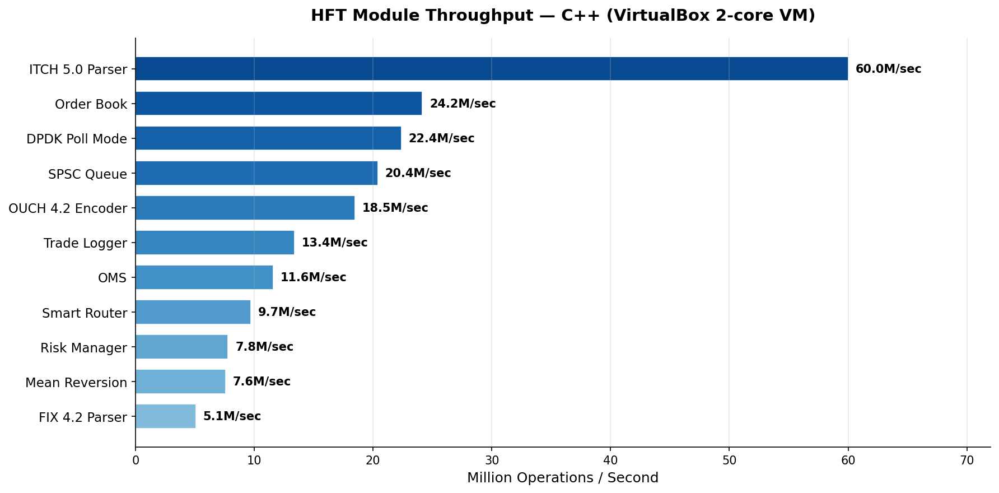
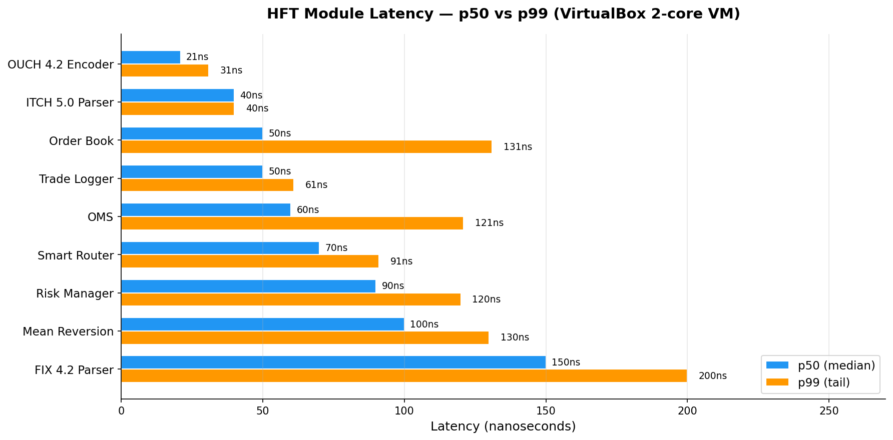

# HFT Infrastructure Lab


Complete low-latency infrastructure lab for HFT systems — kernel tuning, networking, order management, and monitoring.

*Kompletne laboratorium infrastruktury niskooponenciacyjnej dla systemów HFT — dostrajanie kernela, sieci, zarządzanie zamówieniami i monitorowanie.*

## Performance Highlights / Wyniki wydajności (Red Hat EL10, VirtualBox 2-core VM)
- Order book matching: **17.8M orders/sec** (C++, fixed-point int64 prices, p50=50ns, p99=130ns)
- ITCH parser (C++): **60M msg/sec** (16ns/msg, p50=40ns, p99=50ns)
- Market Simulator E2E (C++): **573K msg/sec** (full pipeline: ITCH gen→parse→OMS→P&L)
- OMS (C++): **11.6M orders/sec** (submit+fill, p50=60ns, p99=121ns, fixed-point prices)
- Risk Manager (C++): **7.9M checks/sec** (p50=91ns, p99=140ns)
- Smart Router (C++): **9.7M routes/sec** (p50=70ns, p99=150ns)
- Trade Logger (C++): **14.3M events/sec** (p50=41ns, p99=60ns)
- Mean Reversion Strategy (C++): **8.0M ticks/sec** (p50=100ns, p99=121ns)
- FIX 4.2 Parser (C++): **5.5M msg/sec** (p50=150ns, p99=250ns)
- OUCH 4.2 Encoder (C++): **19.9M msg/sec** (p50=30ns, p99=40ns)
- Lock-free SPSC queue: **17.6M msg/sec** (C++, 10M messages benchmarked)
- Cache latency: L1=1.6ns, L2=4.3ns, L3=154ns, RAM=100-110ns
- Ping-pong thread latency: **81ns p50**, 120ns p99 (8.3M round-trips/sec)
- Orderbook insert: **40ns p50**, 85ns avg (11.8M ops/sec)
- Multicast serialization (C++): **23.2M msg/sec** (serialize+deserialize, p50=20ns)
- DPDK poll mode (C++): **19.9M pkt/sec**, 2.3x faster than interrupt mode
- Estimated tick-to-trade: **~5.8 μs** (software-only, VM) — [full breakdown](docs/tick-to-trade.md)

## Benchmarks




## Modules 

| Module | Description | Language |
|--------|------------|----------|
| kernel-config/ | Hugepages, CPU isolation, sysctl, IRQ affinity | Bash |
| linux-tuning/ | Baseline vs tuned kernel benchmarks | Bash |
| network-latency/ | Network latency and jitter measurement | Bash |
| multicast/ | Market data feed — UDP multicast sender/receiver, binary protocol (23M msg/sec) | C++ |
| orderbook/ | Matching engine with cancel, modify, benchmarks | C++ |
| fix-protocol/ | FIX 4.2 message parser (5.5M msg/sec) | C++ |
| itch-parser/ | NASDAQ ITCH 5.0 binary protocol parser (9 message types, 60M msg/sec) | C++ |
| ouch-protocol/ | NASDAQ OUCH 4.2 order entry protocol (19.9M msg/sec) | C++ |
| dpdk-bypass/ | Kernel bypass simulator — poll vs interrupt benchmark (2.3x speedup) | C++ |
| memory-latency/ | Cache latency measurement (L1/L2/L3/RAM) | C++ |
| lockfree/ | Lock-free SPSC queue for inter-thread comms | C++ |
| oms/ | Order Management System with risk checks, P&L (11.6M orders/sec) | C++ |
| monitoring/ | Real-time infra monitor — /proc parser, alerts (8.6M parse/sec) | C++ |
| strategy/ | Mean reversion trading strategy (8.0M ticks/sec, 100ns p50) | C++ |
| router/ | Smart Order Router — venue selection by price, latency, split (9.7M routes/sec) | C++ |
| risk/ | Risk Manager — circuit breakers, kill switch, position/PnL limits (7.9M checks/sec) | C++ |
| benchmarks/ | Micro-benchmarks: ping-pong latency, orderbook ops, CSV + gnuplot | C++ |
| simulator/ | End-to-end market data pipeline (ITCH→Parser→Strategy→Router→OMS→P&L) | C++ |
| logger/ | Trade Logger / Audit Trail — nanosecond event logging (14.3M events/sec) | C++ |
| tests/ | Integration test suite — cross-module pipeline validation (107 assertions) | C++ |
| docs/ | Architecture diagrams, Linux tuning write-up, benchmark charts | Markdown |

## Quick Start

### Docker (recommended)
```bash
docker build -t hft-lab .
docker run hft-lab              # runs tests + benchmarks + simulator
docker run hft-lab make test    # tests only
docker run hft-lab make simulate  # simulator only
```

### Manual
```bash
make build      # compile all 21 C++ binaries
make test       # run all built-in unit tests (200+)
make benchmark  # run all throughput benchmarks
make simulate   # run end-to-end market simulator (direct, strategy, router, full pipeline)
```

## Environment 
- OS: Red Hat Enterprise Linux 10.1 (Coughlan)
- VM: VirtualBox (2 CPU, 4GB RAM, 40GB disk)
- Kernel: 6.12.0-124. 
