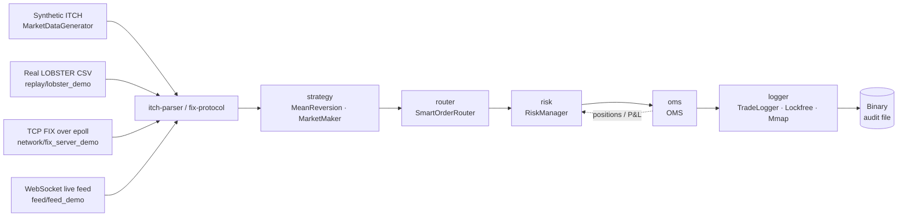

# HFT Infrastructure Lab


Complete low-latency infrastructure lab for HFT systems — kernel tuning, networking, order management, and monitoring.

*Kompletne laboratorium infrastruktury niskooponenciacyjnej dla systemów HFT — dostrajanie kernela, sieci, zarządzanie zamówieniami i monitorowanie.*

## Performance Highlights(Red Hat EL10, VirtualBox 2-core VM)
- Order book matching: **17.8M orders/sec** (C++, fixed-point int64 prices, p50=50ns, p99=130ns)
- Order book — flat-array variant (`orderbook/orderbook_flat.hpp`): **O(1) add/match, zero heap alloc** — see `./orderbook/orderbook_flat 1000000` for live head-to-head vs the std::map baseline
- ITCH parser (C++): **60M msg/sec** (16ns/msg, p50=40ns, p99=50ns)
- Market Simulator E2E (C++): **573K msg/sec** (full pipeline: ITCH gen→parse→OMS→P&L)
- OMS (C++): **11.6M orders/sec** (submit+fill, p50=60ns, p99=121ns, fixed-point prices)
- Risk Manager (C++): **7.9M checks/sec** (p50=91ns, p99=140ns)
- Smart Router (C++): **9.7M routes/sec** (p50=70ns, p99=150ns)
- Trade Logger (C++): **14.3M events/sec** (p50=41ns, p99=60ns)
- Mean Reversion Strategy (C++): **8.0M ticks/sec** (p50=100ns, p99=121ns)
- Market Maker (C++): two-sided quoter with inventory skew, max-inventory caps — see `./strategy/mm_demo 100000` for a live simulation with adversary crosses
- FIX 4.2 Parser (C++): **5.5M msg/sec** (p50=150ns, p99=250ns)
- OUCH 4.2 Encoder (C++): **19.9M msg/sec** (p50=30ns, p99=40ns)
- Lock-free SPSC queue: **17.6M msg/sec** (C++, 10M messages benchmarked)
- Cache latency: L1=1.6ns, L2=4.3ns, L3=154ns, RAM=100-110ns
- Ping-pong thread latency: **81ns p50**, 120ns p99 (8.3M round-trips/sec)
- Orderbook insert: **40ns p50**, 85ns avg (11.8M ops/sec)
- Multicast serialization (C++): **23.2M msg/sec** (serialize+deserialize, p50=20ns)
- DPDK poll mode (C++): **19.9M pkt/sec**, 2.3x faster than interrupt mode
- Estimated tick-to-trade: **~5.8 μs** (software-only, VM) — [full breakdown](docs/tick-to-trade.md)

## Benchmarks


Reproduce locally with `scripts/run_benchmarks.sh`, or trigger the
[`benchmarks` workflow](https://github.com/kanar11/hft-infra-lab/actions/workflows/benchmarks.yml)
from the Actions tab (no local Linux needed — CI runs the script and commits
the result to [`BENCHMARKS.md`](BENCHMARKS.md)).

## Pipeline



Each module is a header-only C++ class; `simulator/sim_demo` wires them together end-to-end. The `lockfree/` headers (SPSC/MPSC/MPMC/Sequencer/WaitableMPSC/VarlenRingBuffer) bridge stages that run on different threads — see `run_pipeline_threaded` in `simulator/market_sim.hpp` for a producer/consumer example. Python bindings (`bindings/pyhft`) wrap the OMS / Risk / FlatOrderBook for notebook-driven research.

## Real-data replay

The synthetic simulator stresses *throughput* on LCG-generated events; for an apples-to-apples check on real Nasdaq order data, use **`replay/lobster_demo`** — it streams a [LOBSTER](https://lobsterdata.com) message CSV (free sample days available) through the same OMS, Risk, and Logger:

```bash
./replay/lobster_demo replay/sample_aapl.csv                          # bundled mini-fixture (20 events)
./replay/lobster_demo /path/to/AAPL_2012-06-21_messages.csv           # full day of real AAPL data
```

Format details and download links: [`replay/README.md`](replay/README.md).

## Live WebSocket feed

Czwarte źródło danych — minimalny klient **RFC 6455 WebSocket** + self-contained mock server w jednym binarce (Binance-style JSON trade stream). Pokazuje strukturę protokołu (HTTP upgrade, frame header, opcode, length encoding) bez zależności od libwebsockets / Boost.Beast.

```bash
./feed/feed_demo   # spawn mock server + WsClient w jednym procesie (50 trade'ów)
```

Szczegóły protokołu, opcody, podłączenie do prawdziwych giełd: [`feed/README.md`](feed/README.md).

## Modules 

| Module | Description | Language |
|--------|------------|----------|
| kernel-config/ | Hugepages, CPU isolation, sysctl, IRQ affinity | Bash |
| linux-tuning/ | Baseline vs tuned kernel benchmarks | Bash |
| network-latency/ | Network latency and jitter measurement | Bash |
| multicast/ | Market data feed — UDP multicast sender/receiver, binary protocol (23M msg/sec) | C++ |
| orderbook/ | Matching engine: 3 variants — std::map basic, std::map + cancel/modify, flat-array O(1) | C++ |
| fix-protocol/ | FIX 4.2 parser + session validation (CheckSum tag 10, BodyLength tag 9, SOH delimiter) + message builder (5.5M msg/sec) | C++ |
| itch-parser/ | NASDAQ ITCH 5.0 binary protocol parser (9 message types, 60M msg/sec) | C++ |
| ouch-protocol/ | NASDAQ OUCH 4.2 order entry protocol (19.9M msg/sec) | C++ |
| dpdk-bypass/ | Kernel bypass simulator — poll vs interrupt benchmark (2.3x speedup) | C++ |
| memory-latency/ | Cache latency measurement (L1/L2/L3/RAM) | C++ |
| lockfree/ | 6 lock-free primitives: SPSC, MPSC, MPMC, Sequencer, WaitableMPSC, VarlenRingBuffer | C++ |
| common/ | Shared types (Side enum), sym_to_key, time helpers used across modules | C++ |
| oms/ | Order Management System with risk checks, P&L, pending exposure (11.6M orders/sec) | C++ |
| monitoring/ | Real-time infra monitor — /proc parser, alerts (8.6M parse/sec) | C++ |
| strategy/ | Three strategy families: reactive (mean reversion) + proactive (market maker) + execution algos (TWAP, VWAP w/ U-shape volume profile) | C++ |
| router/ | Smart Order Router — venue selection by effective price (quote ± maker/taker fee), latency, split (9.7M routes/sec) | C++ |
| risk/ | Risk Manager — circuit breakers, kill switch, position/PnL limits, pending exposure (7.9M checks/sec) | C++ |
| benchmarks/ | Micro-benchmarks: ping-pong latency, orderbook ops, CSV + gnuplot | C++ |
| simulator/ | End-to-end pipeline (ITCH→Parser→Strategy→Router→OMS→P&L), sync + threaded variants | C++ |
| replay/ | Real Nasdaq order replay from LOBSTER CSVs through the same OMS pipeline | C++ |
| logger/ | Trade Logger — 3 variants: hand-rolled SPSC ring, lockfree::SPSCQueue-backed, mmap-backed | C++ |
| network/ | Epoll-based async TCP server + self-test FIX ingestion demo | C++ |
| feed/ | Minimal RFC 6455 WebSocket client + self-contained mock server (Binance-style JSON trades) | C++ |
| bindings/ | pybind11 Python extension exposing OMS, RiskManager, FlatOrderBook | C++/Python |
| tests/ | Integration test suite — cross-module pipeline validation (200+ assertions) | C++ |
| docs/ | Architecture diagrams, Linux tuning write-up, benchmark charts | Markdown |

## Quick Start

### Docker (recommended)
```bash
docker build -t hft-lab .
docker run hft-lab              # runs tests + benchmarks + simulator
docker run hft-lab make test    # tests only
docker run hft-lab make simulate  # simulator only
```

### Manual
```bash
make build      # compile all 21 C++ binaries
make test       # run all built-in unit tests (200+)
make benchmark  # run all throughput benchmarks
make simulate   # run end-to-end market simulator (direct, strategy, router, full pipeline)
```

## Environment 
- OS: Red Hat Enterprise Linux 10.1 (Coughlan)
- VM: VirtualBox (2 CPU, 4GB RAM, 40GB disk)
- Kernel: 6.12.0-124. 
